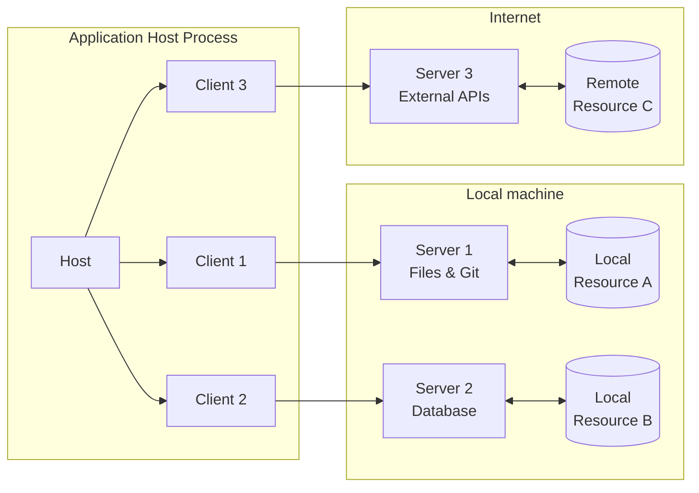
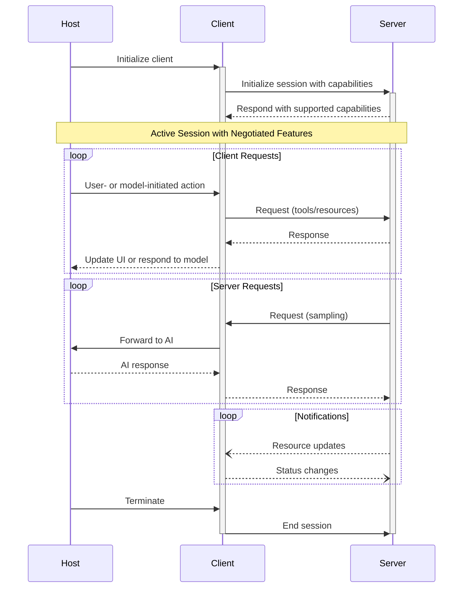

# Key Changes

<div id="enable-section-numbers" />

This document lists changes made to the Model Context Protocol (MCP) specification since
the previous revision, [2025-03-26](/specification/2025-03-26).

## Major changes

1. Remove support for JSON-RPC **[batching](https://www.jsonrpc.org/specification#batch)**
   (PR [#416](https://github.com/modelcontextprotocol/specification/pull/416))
2. Add support for [structured tool output](/specification/2025-06-18/server/tools#structured-content)
   (PR [#371](https://github.com/modelcontextprotocol/modelcontextprotocol/pull/371))
3. Classify MCP servers as [OAuth Resource Servers](/specification/2025-06-18/basic/authorization#authorization-server-discovery),
   adding protected resource metadata to discover the corresponding Authorization server.
   (PR [#338](https://github.com/modelcontextprotocol/modelcontextprotocol/pull/338))
4. Require MCP clients to implement Resource Indicators as described in [RFC 8707](https://www.rfc-editor.org/rfc/rfc8707.html) to prevent
   malicious servers from obtaining access tokens.
   (PR [#734](https://github.com/modelcontextprotocol/modelcontextprotocol/pull/734))
5. Clarify [security considerations](/specification/2025-06-18/basic/authorization#security-considerations) and best practices
   in the authorization spec and in a new [security best practices page](/specification/2025-06-18/basic/security_best_practices).
6. Add support for **[elicitation](/specification/2025-06-18/client/elicitation)**, enabling servers to request additional
   information from users during interactions.
   (PR [#382](https://github.com/modelcontextprotocol/modelcontextprotocol/pull/382))
7. Add support for **[resource links](/specification/2025-06-18/server/tools#resource-links)** in
   tool call results. (PR [#603](https://github.com/modelcontextprotocol/modelcontextprotocol/pull/603))
8. Require [negotiated protocol version to be specified](/specification/2025-06-18/basic/transports#protocol-version-header)
   via `MCP-Protocol-Version` header in subsequent requests when using HTTP (PR [#548](https://github.com/modelcontextprotocol/modelcontextprotocol/pull/548)).
9. Change **SHOULD** to **MUST** in [Lifecycle Operation](/specification/2025-06-18/basic/lifecycle#operation)

## Other schema changes

1. Add `_meta` field to additional interface types (PR [#710](https://github.com/modelcontextprotocol/modelcontextprotocol/pull/710)),
   and specify [proper usage](/specification/2025-06-18/basic#meta).
2. Add `context` field to `CompletionRequest`, providing for completion requests to include
   previously-resolved variables (PR [#598](https://github.com/modelcontextprotocol/modelcontextprotocol/pull/598)).
3. Add `title` field for human-friendly display names, so that `name` can be used as a programmatic
   identifier (PR [#663](https://github.com/modelcontextprotocol/modelcontextprotocol/pull/663))

## Full changelog

For a complete list of all changes that have been made since the last protocol revision,
[see GitHub](https://github.com/modelcontextprotocol/specification/compare/2025-03-26...2025-06-18).

# Architecture

<div id="enable-section-numbers" />

The Model Context Protocol (MCP) follows a client-host-server architecture where each
host can run multiple client instances. This architecture enables users to integrate AI
capabilities across applications while maintaining clear security boundaries and
isolating concerns. Built on JSON-RPC, MCP provides a stateful session protocol focused
on context exchange and sampling coordination between clients and servers.

## Core Components



### Host

The host process acts as the container and coordinator:

* Creates and manages multiple client instances
* Controls client connection permissions and lifecycle
* Enforces security policies and consent requirements
* Handles user authorization decisions
* Coordinates AI/LLM integration and sampling
* Manages context aggregation across clients

### Clients

Each client is created by the host and maintains an isolated server connection:

* Establishes one stateful session per server
* Handles protocol negotiation and capability exchange
* Routes protocol messages bidirectionally
* Manages subscriptions and notifications
* Maintains security boundaries between servers

A host application creates and manages multiple clients, with each client having a 1:1
relationship with a particular server.

### Servers

Servers provide specialized context and capabilities:

* Expose resources, tools and prompts via MCP primitives
* Operate independently with focused responsibilities
* Request sampling through client interfaces
* Must respect security constraints
* Can be local processes or remote services

## Design Principles

MCP is built on several key design principles that inform its architecture and
implementation:

1. **Servers should be extremely easy to build**
   * Host applications handle complex orchestration responsibilities
   * Servers focus on specific, well-defined capabilities
   * Simple interfaces minimize implementation overhead
   * Clear separation enables maintainable code

2. **Servers should be highly composable**
   * Each server provides focused functionality in isolation
   * Multiple servers can be combined seamlessly
   * Shared protocol enables interoperability
   * Modular design supports extensibility

3. **Servers should not be able to read the whole conversation, nor "see into" other
   servers**
   * Servers receive only necessary contextual information
   * Full conversation history stays with the host
   * Each server connection maintains isolation
   * Cross-server interactions are controlled by the host
   * Host process enforces security boundaries

4. **Features can be added to servers and clients progressively**
   * Core protocol provides minimal required functionality
   * Additional capabilities can be negotiated as needed
   * Servers and clients evolve independently
   * Protocol designed for future extensibility
   * Backwards compatibility is maintained

## Capability Negotiation

The Model Context Protocol uses a capability-based negotiation system where clients and
servers explicitly declare their supported features during initialization. Capabilities
determine which protocol features and primitives are available during a session.

* Servers declare capabilities like resource subscriptions, tool support, and prompt
  templates
* Clients declare capabilities like sampling support and notification handling
* Both parties must respect declared capabilities throughout the session
* Additional capabilities can be negotiated through extensions to the protocol



Each capability unlocks specific protocol features for use during the session. For
example:

* Implemented [server features](/specification/2025-06-18/server) must be advertised in the
  server's capabilities
* Emitting resource subscription notifications requires the server to declare
  subscription support
* Tool invocation requires the server to declare tool capabilities
* [Sampling](/specification/2025-06-18/client) requires the client to declare support in its
  capabilities

This capability negotiation ensures clients and servers have a clear understanding of
supported functionality while maintaining protocol extensibility.

# Overview

<div id="enable-section-numbers" />

<Info>**Protocol Revision**: 2025-06-18</Info>

The Model Context Protocol consists of several key components that work together:

* **Base Protocol**: Core JSON-RPC message types
* **Lifecycle Management**: Connection initialization, capability negotiation, and
  session control
* **Authorization**: Authentication and authorization framework for HTTP-based transports
* **Server Features**: Resources, prompts, and tools exposed by servers
* **Client Features**: Sampling and root directory lists provided by clients
* **Utilities**: Cross-cutting concerns like logging and argument completion

All implementations **MUST** support the base protocol and lifecycle management
components. Other components **MAY** be implemented based on the specific needs of the
application.

These protocol layers establish clear separation of concerns while enabling rich
interactions between clients and servers. The modular design allows implementations to
support exactly the features they need.

## Messages

All messages between MCP clients and servers **MUST** follow the
[JSON-RPC 2.0](https://www.jsonrpc.org/specification) specification. The protocol defines
these types of messages:

### Requests

Requests are sent from the client to the server or vice versa, to initiate an operation.

```typescript  theme={null}
{
  jsonrpc: "2.0";
  id: string | number;
  method: string;
  params?: {
    [key: string]: unknown;
  };
}
```

* Requests **MUST** include a string or integer ID.
* Unlike base JSON-RPC, the ID **MUST NOT** be `null`.
* The request ID **MUST NOT** have been previously used by the requestor within the same
  session.

### Responses

Responses are sent in reply to requests, containing the result or error of the operation.

```typescript  theme={null}
{
  jsonrpc: "2.0";
  id: string | number;
  result?: {
    [key: string]: unknown;
  }
  error?: {
    code: number;
    message: string;
    data?: unknown;
  }
}
```

* Responses **MUST** include the same ID as the request they correspond to.
* **Responses** are further sub-categorized as either **successful results** or
  **errors**. Either a `result` or an `error` **MUST** be set. A response **MUST NOT**
  set both.
* Results **MAY** follow any JSON object structure, while errors **MUST** include an
  error code and message at minimum.
* Error codes **MUST** be integers.

### Notifications

Notifications are sent from the client to the server or vice versa, as a one-way message.
The receiver **MUST NOT** send a response.

```typescript  theme={null}
{
  jsonrpc: "2.0";
  method: string;
  params?: {
    [key: string]: unknown;
  };
}
```

* Notifications **MUST NOT** include an ID.

## Auth

MCP provides an [Authorization](/specification/2025-06-18/basic/authorization) framework for use with HTTP.
Implementations using an HTTP-based transport **SHOULD** conform to this specification,
whereas implementations using STDIO transport **SHOULD NOT** follow this specification,
and instead retrieve credentials from the environment.

Additionally, clients and servers **MAY** negotiate their own custom authentication and
authorization strategies.

For further discussions and contributions to the evolution of MCP’s auth mechanisms, join
us in
[GitHub Discussions](https://github.com/modelcontextprotocol/specification/discussions)
to help shape the future of the protocol!

## Schema

The full specification of the protocol is defined as a
[TypeScript schema](https://github.com/modelcontextprotocol/specification/blob/main/schema/2025-06-18/schema.ts).
This is the source of truth for all protocol messages and structures.

There is also a
[JSON Schema](https://github.com/modelcontextprotocol/specification/blob/main/schema/2025-06-18/schema.json),
which is automatically generated from the TypeScript source of truth, for use with
various automated tooling.

### General fields

#### `_meta`

The `_meta` property/parameter is reserved by MCP to allow clients and servers
to attach additional metadata to their interactions.

Certain key names are reserved by MCP for protocol-level metadata, as specified below;
implementations MUST NOT make assumptions about values at these keys.

Additionally, definitions in the [schema](https://github.com/modelcontextprotocol/specification/blob/main/schema/2025-06-18/schema.ts)
may reserve particular names for purpose-specific metadata, as declared in those definitions.

**Key name format:** valid `_meta` key names have two segments: an optional **prefix**, and a **name**.

**Prefix:**

* If specified, MUST be a series of labels separated by dots (`.`), followed by a slash (`/`).
  * Labels MUST start with a letter and end with a letter or digit; interior characters can be letters, digits, or hyphens (`-`).
* Any prefix beginning with zero or more valid labels, followed by `modelcontextprotocol` or `mcp`, followed by any valid label,
  is **reserved** for MCP use.
  * For example: `modelcontextprotocol.io/`, `mcp.dev/`, `api.modelcontextprotocol.org/`, and `tools.mcp.com/` are all reserved.

**Name:**

* Unless empty, MUST begin and end with an alphanumeric character (`[a-z0-9A-Z]`).
* MAY contain hyphens (`-`), underscores (`_`), dots (`.`), and alphanumerics in between.
